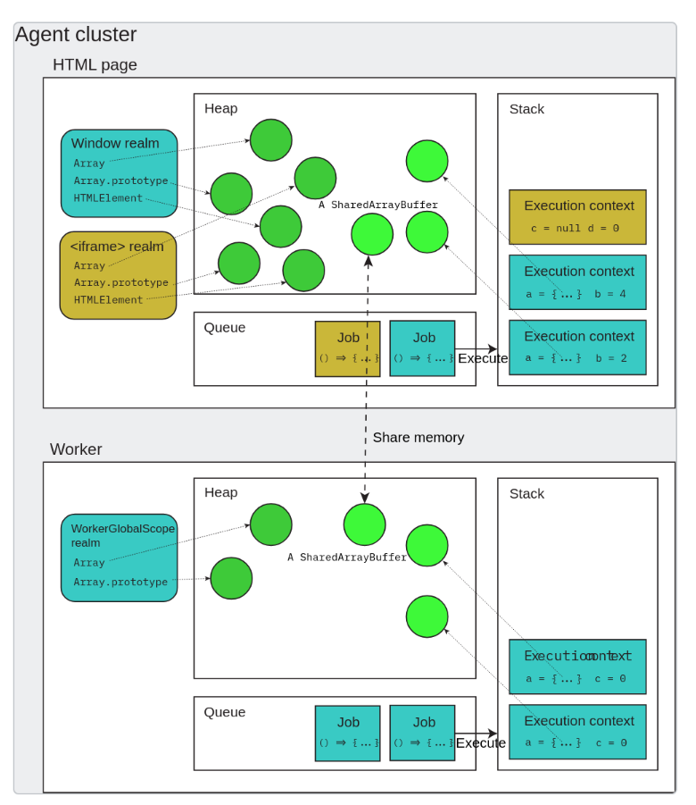

O que e comumente chamado de **Javascript** e a implementacao do **ECMAScript** em navegadores e ambientes de execucao que seguem a especificao.

O Javascript como conhecemos e na verdade uma implementacao de uma especificao definida por uma organização mundial. Quando falamos em Javascript, estamos na verdade nos referindo a uma linguagem definida por uma serie de regras impostas pelo padrao **ECMAScript**, sintaxe, estrutura de controle, operadores, tipos de dados e outros aspectos basicos, tudo isso escrito em documentos de acesso geral e organizados por um conjunto de organizacoes. O ECMAScript nao define um ambiente de execucao e nem as APIs comuns de `dom` e `window` utilizada pelos navegadores, ou `fs` e `buffer` definidas pelo `NodeJs`.

Existem outras linguagem que seguem as especificoes de sintaxe basicas do ECMAScript, como o **ActionScript**, porem por nao seguir a risca todas as definicoes ela nao uma implementacao do Javascript, mas sim uma linguagem de programacao irma com algumas similiaridades.

Voltando o Javascript, o que conhecemos como ele e uma implementacao da especificao definidade pela ECMAScript. Porem, existem diferentes implementacoes diferentes, todas elas continuam sendo Javascript pois seguem a risca o documento de regras definido pela organizacao. A implementacao mais conhecida e a **V8 da Google**. Desenvolvida utilizando C++, ela e utilizada para interpretar o Javascript nos navegadores e pelo [NodeJS](./#2-nodejs.md), porem outras empresas como **Firefox (SpiderMonkey)** e **Microsoft (Chakra para o Edge antigo)** tem as suas proprias implementacoes. Todas essas implementacoes sao conhecidas como **Engine** ou motores do Javascript.

Para a execucao do Javascript e necessaria a cooperacao de duas pecas principais, um motor (Engine) e um ambiente de execucao. Enquanto o motor oferece as funcionalidades basicas de operacao que qualquer linguagem oferece, o ambiente de execucao proporciona APIs que possibilitam a comunicacao com propriedades externas ao Javascript como, criacao de arquivos (NodeJs) e HTML (HTML DOM).

Na especificao do Javascript cada instancia de execucao de Javascript e chamada de **agente de execucao**, pode-se entender instancia de execucao como uma entidade isolada que executa codigo Javascript independente, basicamente, uma instancia autonoma do motor de execucao da linguagem:
- Para web browser um agente de execucao pode ser cada aba aberta no navegador.
- No NodeJS cada processo e um agent proprio
- Com [**WebWorkers**](https://developer.mozilla.org/en-US/docs/Web/API/Web_Workers_API/Using_web_workers) cada worker e um agent distinto.

Para ser considerado um agent e necessario ter 3 coisas:
- **Heap (of objects)**: Isso e apenas um nome para determinar uma grande regiao de memoria (normalmente desorganizada). Essa regiao de memoria e populada de objetos criados pelo programa, por exemplo:
```Javascript

const test = 1;

function executeTest() {
  console.log(`Test ${test}`);
}

executeTest();
```

Nesse caso todo esse codigo e armazenado na **heap** para no momento da execucao linha a linha, as chamadas de funcoes serem adicionadas na **Call Stack**
- **Queue (of jobs)**: Isso e conhecido como **Event Loop** (sera explicado melhor ao falar de [NodeJS](./#2-nodejs.md)), ele permite Javascript execute codigo assincrono mesmo sendo **single thread**.
- **Stack (of execution contexts)**: Tambem conhecido como **Call Stack**, permite que o controle de execucao seja transferido entre funcoes, entrando e saindo de contextos de execucao. Todo trabalho ou OPERACAO (nao declaracao) a ser executada entra na Call Stack "pushing" um novo bloco para a stack e sai executando um "popping" na stack.

Um agent e conceitualmente semelhante a uma thread, porem isso nao significa que na implementacao (V8, SpiderMonkey, Chakra...) ele sera mapeado diretamente para uma thread do SO.

Um agent pode ser um dos seguintes
- Um window agent origem similar que contem diversos objetos `window` que podem alcancar uns aos outros diretamente ou usando `document.domain`
- O worker agent dedicado com um unico `DedicatedWorkerGlobalScope`
- O worker agent compartilhado com um unico `SharedWorkerGlobalScope`
- Um **Service Worker** agent com um unico `ServiceWorkerGlobalScope`
- Um **Worklet** agent com um unico `WorkletGlobalScope`

Um agent alem de possuir a sua propria Heap, Call Stack e Event Loop, ainda possui mais duas conceitos que deve implementar:
- Um ou mais **Realms**
- Um modelo de memoria unico.

**Realms** e basicamente um ecossistema no qual o codigo Javascript vive, um realm e formado por um ambiente global de execucao (o escopo mais externo possivel), um objeto global e todos os objetos que fazem parte dele (JSON, Math, Reflect) e o proprio codigo Javascript. E possivel ter diversos Realms um dentro do outro, e cada um desses ira implementar esses 3 mesmos conceitos. Um objeto global e referenciado como `window` no contexto do browser e `global` no contexto do NodeJs, em ambos a diretiva `globalThis` pode ser utilizada.

No contexto do browser existe o **realm base**, `window`, todo aplicativo web inicia-se a partir desse realm, porem e possivel a partir desse aplicativo criar novos realms, cada um deles tera o seu proprio escopo, objetos globais e codigo Javascript.

Todo Realm vive dentro de um **agent**, porem um agent pode conter multiplos realms. No browser, realms podem ser criados de diversas formas, como exemplo, mas nao se limita a esses:
1. Dois Iframes da mesma origem irao formar dois realms debaixo de um unico **agent**.
2. Dois Iframes de origens diferentes irao formar dois realms debaixo de agents diferentes
3. O realm principal a um **Service Worker** sao dois realms separados dentro de agents diferentes que executam em um mesmo **Agent Cluster**



Um **Agent Cluster** e um agrupamento de agents que podem compartilhar recursos entre si, eles tem permissao para se comunicar e compartilhar memoria diretamente. No contexto do browser por exemplo:
- Cada aba e normalmente um agent isolado
- Se uma aba cria um **Web Worker** (agent separado) o worker e a aba ficam no mesmo agent cluster, com isso ele podem se comunicar por meio de `sharedArrayBuffer` ou por mensagens `postMessage`.
- Se duas abas sao de origens diferentes, elas pertencem a agents clsuter diferentes.

https://stackoverflow.com/questions/49832187/how-to-understand-js-realms
https://weizmangal.com/page-what-is-a-realm-in-js/#A-realm-provides-the-JavaScript-program-with-its-own-single-global-execution-environment.
https://tc39.es/ecma262/#sec-global-environment-records
